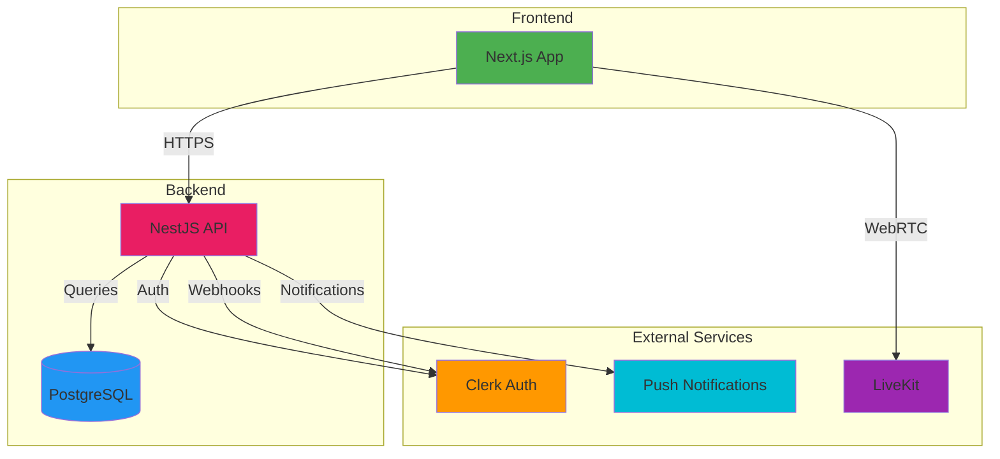

# Webyalaya - System Overview

## Problem Statement

Traditional learning platforms often lack peer-to-peer interaction and personalized learning experiences. Students struggle to find mentors who can teach specific skills, while skilled individuals lack opportunities to monetize their expertise. There's a gap in the market for a platform that connects learners with peers in a structured, gamified environment.

## Objectives / Goals

- **Connect Learners**: Enable students to find peers who can teach skills they want to learn
- **Enable Teaching**: Allow skilled individuals to monetize their expertise through peer sessions
- **Facilitate Group Learning**: Support study rooms for collaborative learning experiences
- **Gamify Learning**: Use virtual coins to incentivize teaching and learning
- **Build Trust**: Implement review and rating systems to ensure quality interactions
- **Real-time Communication**: Provide seamless video conferencing integration for sessions

## High-Level Feature List

### Core Features
- **User Authentication & Profiles**: Secure authentication via Clerk, comprehensive user profiles with skills, bio, and ratings
- **Skills Management**: Users can tag skills they HAVE (can teach) and WANT (want to learn)
- **Peer Sessions**: One-on-one tutoring sessions with payment escrow system
- **Study Rooms**: Group learning sessions with capacity management
- **Virtual Currency**: Coin-based payment system for session transactions
- **Reviews & Ratings**: 5-star rating system with text reviews
- **Notifications**: Real-time notifications for session requests, reminders, and updates
- **Browse & Search**: Discover peers and study rooms with filtering by skills
- **Dashboard**: Personalized dashboard showing metrics, upcoming sessions, and activity

### Supporting Features
- **LiveKit Integration**: Real-time video/audio communication for sessions
- **Payment Escrow**: Secure payment handling with automatic refunds on cancellation
- **Session Reminders**: Automated reminders 24h, 1h, and 5m before sessions
- **Review Reminders**: Notifications to encourage post-session reviews

## Target Users + Personas

### Primary Personas

1. **The Learner (Student)**
   - Age: 18-30
   - Goal: Learn new skills from peers
   - Pain Points: Expensive courses, lack of personalized attention
   - Use Cases: Browse peers, request sessions, join study rooms

2. **The Teacher (Mentor)**
   - Age: 20-35
   - Goal: Monetize expertise, help others learn
   - Pain Points: No platform to teach, irregular income
   - Use Cases: Accept session requests, create study rooms, earn coins

3. **The Collaborator**
   - Age: 18-28
   - Goal: Learn and teach simultaneously
   - Pain Points: One-way learning platforms
   - Use Cases: Both request and accept sessions, participate in study rooms

## High-Level Architecture

## System Components

- **Web Frontend (Next.js)**: React-based SPA with App Router, Tailwind CSS, shadcn/ui components
- **Backend API (NestJS)**: RESTful API with TypeScript, Prisma ORM, modular architecture
- **Database (PostgreSQL)**: Relational database with Prisma migrations
- **Authentication (Clerk)**: Managed authentication service with webhook integration
- **Real-time Communication (LiveKit)**: WebRTC-based video/audio for sessions
- **Push Notifications**: Browser push notifications for real-time updates

## Key Differentiators

- **Peer-to-Peer Focus**: Direct connection between learners and teachers
- **Virtual Currency**: Gamified coin system instead of traditional payments
- **Dual Role Support**: Users can both teach and learn
- **Group & Individual Sessions**: Flexible learning formats
- **Skill-Based Matching**: Find peers based on specific skills
- **Trust System**: Reviews and ratings ensure quality interactions

