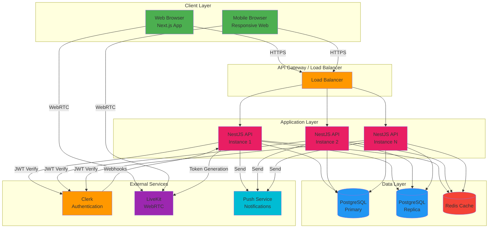
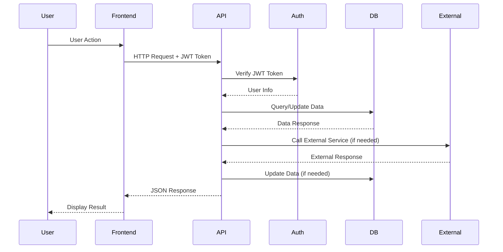

# System Architecture

## Overall Architecture Diagram

## Components

### Web Frontend (Next.js / my-app)

**Technology Stack:**
- Next.js 14+ (App Router)
- React 18+
- TypeScript
- Tailwind CSS
- shadcn/ui components
- Clerk for authentication

**Responsibilities:**
- Render user interface
- Handle user interactions
- Manage client-side state
- Make API calls to backend
- Real-time WebRTC communication via LiveKit
- Push notification handling

**Key Features:**
- Server-side rendering (SSR) for SEO
- Client-side routing
- Form validation
- Error handling and display
- Responsive design

### Backend API (NestJS)

**Technology Stack:**
- NestJS framework
- TypeScript
- Prisma ORM
- class-validator & class-transformer
- Swagger/OpenAPI

**Responsibilities:**
- Handle HTTP requests
- Business logic implementation
- Data validation
- Database operations
- Authentication verification
- External service integration
- Notification dispatch

**Module Structure:**
- Users: Profile management, skills
- Skills: Skill CRUD operations
- Study Rooms: Group session management
- Peer Sessions: One-on-one session management
- Payments: Transaction handling
- Reviews: Rating and review system
- Notifications: Notification management
- Browse: Search and discovery
- Dashboard: User metrics and data
- Chat: Real-time messaging (via LiveKit)
- Upload: File upload handling
- LiveKit: WebRTC token generation

### Database (PostgreSQL)

**Technology:**
- PostgreSQL 14+
- Prisma ORM for type-safe queries
- Connection pooling

**Responsibilities:**
- Store user data
- Store session data
- Store payment transactions
- Store reviews and ratings
- Store notifications
- Maintain referential integrity

**Key Tables:**
- User, Skill, UserSkill
- StudyRoom, StudyRoomParticipant, StudyRoomSkill
- PeerSession, PeerSessionSkill
- Payment, Review, Notification
- Metrics, Channel, Message, ChannelMember
- PushSubscription

### External Services

#### Clerk (Authentication)
- **Purpose**: User authentication and authorization
- **Integration**: JWT token verification, webhook for user sync
- **Features**: Email/password, OAuth providers, session management

#### LiveKit (Real-time Communication)
- **Purpose**: WebRTC-based video/audio for sessions
- **Integration**: Token generation API, WebRTC client SDK
- **Features**: Video calls, audio calls, screen sharing, chat

#### Push Notifications Service
- **Purpose**: Browser push notifications
- **Integration**: Web Push API, service worker
- **Features**: Real-time notifications, notification preferences

## Data Flow Overview

### Request Lifecycle

### Session Creation Flow

1. **User browses peers** → Frontend calls `GET /api/browse?tab=peers`
2. **User selects peer** → Frontend calls `GET /api/users/:userId`
3. **User requests session** → Frontend calls `POST /api/peer-sessions`
4. **Backend validates** → Checks coin balance, creates session
5. **Backend creates payment** → Payment in ESCROW status
6. **Backend sends notification** → Notifies peer about request
7. **Peer accepts** → Frontend calls `PATCH /api/peer-sessions/:id/status`
8. **Backend updates** → Session status to UPCOMING, payment confirmed
9. **Session starts** → Users join LiveKit room
10. **Session completes** → Status updated to DONE, payment released

### Payment Flow

1. **Session Request** → Payment created with ESCROW status
2. **Coins Deducted** → From requester's balance
3. **Session Accepted** → Payment remains in ESCROW
4. **Session Cancelled** → Payment status REFUNDED, coins returned
5. **Session Completed** → Payment status RECEIVED, coins transferred to teacher

## Deployment Architecture

### Development
- Local PostgreSQL database
- Single NestJS instance
- Next.js dev server
- Clerk development keys

### Production
- Managed PostgreSQL (AWS RDS / Railway)
- Multiple NestJS instances behind load balancer
- Next.js deployed on Vercel / AWS
- Clerk production keys
- Redis for caching (optional)
- CDN for static assets

## Security Architecture

- **Authentication**: Clerk JWT tokens, verified on every request
- **Authorization**: Role-based access control (future enhancement)
- **Data Validation**: Input validation at API layer
- **SQL Injection**: Prevented via Prisma ORM
- **XSS**: Prevented via React escaping
- **CORS**: Configured for specific origins
- **Rate Limiting**: Applied to authentication endpoints
- **HTTPS**: Enforced for all communications
- **Secrets Management**: Environment variables, never committed

## Scalability Considerations

- **Horizontal Scaling**: Stateless API design allows multiple instances
- **Database**: Read replicas for read-heavy operations
- **Caching**: Redis for frequently accessed data
- **CDN**: Static assets served via CDN
- **Connection Pooling**: Database connection pooling
- **Pagination**: All list endpoints support pagination
- **Background Jobs**: Future enhancement for async tasks

