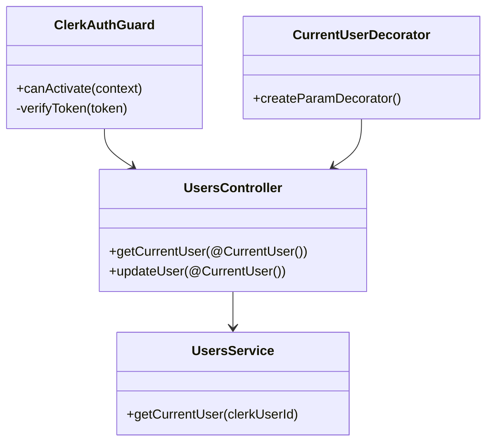
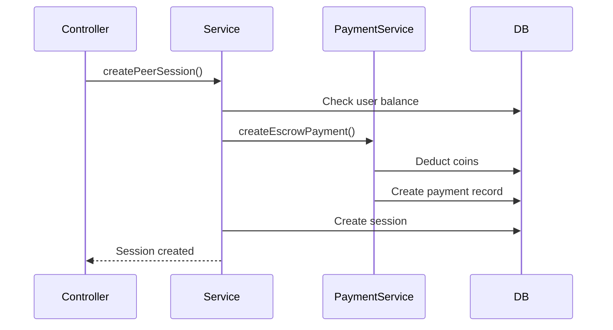

# Backend Low-Level Design

## Modules / Services Responsibilities

### Core Modules

#### Users Module (`src/users/`)
**Responsibilities:**
- User profile management (CRUD operations)
- Clerk webhook handling for user synchronization
- User skills management (HAS/WANTS skills)
- Public profile retrieval
- User metrics calculation

**Key Classes:**
- `UsersController`: Handles HTTP requests for user endpoints
- `UsersService`: Contains business logic for user operations
- `UpdateUserDto`: Data transfer object for user updates

**Key Methods:**
- `getCurrentUser(clerkUserId)`: Get authenticated user's profile
- `updateUser(clerkUserId, updateDto)`: Update user profile
- `getUserById(userId)`: Get public user profile
- `getUserSkills(userId)`: Get user's skills
- `syncUserFromClerk(clerkData)`: Sync user from Clerk webhook

#### Skills Module (`src/skills/`)
**Responsibilities:**
- Skill CRUD operations
- Skill search and pagination
- Duplicate skill prevention

**Key Classes:**
- `SkillsController`: Handles skill endpoints
- `SkillsService`: Business logic for skills
- `CreateSkillDto`: DTO for creating skills

#### Study Rooms Module (`src/study-rooms/`)
**Responsibilities:**
- Study room creation and management
- Participant management and capacity enforcement
- Joining fee processing
- Study room filtering and search

**Key Classes:**
- `StudyRoomsController`: Handles study room endpoints
- `StudyRoomsService`: Business logic for study rooms
- `CreateStudyRoomDto`, `UpdateStudyRoomDto`: DTOs for study rooms

**Key Methods:**
- `createStudyRoom(userId, createDto)`: Create new study room
- `joinStudyRoom(userId, roomId)`: Add participant to room
- `updateStudyRoom(userId, roomId, updateDto)`: Update room (owner only)

#### Peer Sessions Module (`src/peer-sessions/`)
**Responsibilities:**
- Peer session request creation
- Session status management
- Payment escrow handling
- Session filtering and retrieval

**Key Classes:**
- `PeerSessionsController`: Handles peer session endpoints
- `PeerSessionsService`: Business logic for peer sessions
- `CreatePeerSessionDto`, `UpdatePeerSessionStatusDto`: DTOs

**Key Methods:**
- `createPeerSession(userId, createDto)`: Create session request
- `updateSessionStatus(userId, sessionId, status)`: Update session status
- `handlePaymentOnStatusChange(session, newStatus)`: Process payments

#### Payments Module (`src/payments/`)
**Responsibilities:**
- Payment record creation
- Coin balance management
- Escrow handling
- Refund processing

**Key Classes:**
- `PaymentsService`: Payment processing logic

**Key Methods:**
- `createEscrowPayment(...)`: Create escrow payment
- `releasePayment(paymentId)`: Release payment to recipient
- `refundPayment(paymentId)`: Refund payment to payer

#### Reviews Module (`src/reviews/`)
**Responsibilities:**
- Review creation and validation
- Rating calculation
- Review retrieval and filtering

**Key Classes:**
- `ReviewsController`: Handles review endpoints
- `ReviewsService`: Business logic for reviews
- `CreateReviewDto`: DTO for creating reviews

#### Notifications Module (`src/notifications/`)
**Responsibilities:**
- Notification creation
- Read status management
- Notification retrieval with pagination

**Key Classes:**
- `NotificationsController`: Handles notification endpoints
- `NotificationsService`: Business logic for notifications

#### Browse Module (`src/browse/`)
**Responsibilities:**
- Peer browsing with filtering
- Study room browsing with filtering
- Search functionality

**Key Classes:**
- `BrowseController`: Handles browse endpoints
- `BrowseService`: Business logic for browsing

#### Dashboard Module (`src/dashboard/`)
**Responsibilities:**
- Aggregate user metrics
- Provide dashboard data (sessions, notifications, etc.)

**Key Classes:**
- `DashboardController`: Handles dashboard endpoint
- `DashboardService`: Aggregates dashboard data

## Folder/Module Structure

```
src/
├── app.module.ts              # Root module, imports all feature modules
├── main.ts                    # Bootstrap application, configure middleware
├── users/                     # User management
│   ├── users.module.ts
│   ├── users.controller.ts
│   ├── users.service.ts
│   └── dto/
│       └── user.dto.ts
├── skills/                    # Skills CRUD
├── study-rooms/              # Study room management
├── peer-sessions/           # Peer session management
├── reviews/                 # Review system
├── notifications/           # Notification management
├── payments/                # Payment processing
├── browse/                  # Browse and search
├── dashboard/               # Dashboard aggregation
├── chat/                    # Real-time chat
├── livekit/                 # LiveKit integration
├── upload/                  # File uploads
├── prisma/                  # Prisma service (global)
│   ├── prisma.module.ts
│   └── prisma.service.ts
└── common/                  # Shared utilities
    ├── decorators/
    │   └── current-user.decorator.ts
    ├── dto/
    │   ├── pagination.dto.ts
    │   └── error-response.dto.ts
    └── guards/
        └── clerk-auth.guard.ts
```

## Class/Service Diagrams

### Authentication Flow



### Payment Escrow Flow



## How Validation is Done

### Global Validation Pipe
Configured in `main.ts`:
```typescript
app.useGlobalPipes(
  new ValidationPipe({
    whitelist: true,              // Strip unknown properties
    forbidNonWhitelisted: true,    // Reject unknown properties
    transform: true,              // Transform payloads to DTO instances
  }),
);
```

### DTO Validation
- Use `class-validator` decorators on DTOs:
  - `@IsString()`, `@IsEmail()`, `@IsOptional()`
  - `@Min()`, `@Max()`, `@IsEnum()`
  - Custom validators for complex rules

### Example DTO:
```typescript
export class CreatePeerSessionDto {
  @IsString()
  @IsNotEmpty()
  title: string;

  @IsString()
  @IsOptional()
  description?: string;

  @IsDateString()
  date: string;

  @IsInt()
  @Min(15)
  @Max(480)
  duration: number;

  @IsArray()
  @IsString({ each: true })
  skillIds: string[];
}
```

## How Errors are Handled

### Standardized Error Format
All errors follow this structure:
```typescript
{
  code: string;        // Error code (e.g., 'INSUFFICIENT_FUNDS')
  message: string;     // Human-readable message
  details?: any;       // Additional error details
  field?: string;      // Field that caused the error
  timestamp: string;   // ISO timestamp
}
```

### Error Handling Pattern
1. **Service Layer**: Throws NestJS exceptions (`NotFoundException`, `BadRequestException`, etc.)
2. **Global Exception Filter**: Catches and formats errors (future enhancement)
3. **HTTP Status Codes**: 
   - `400`: Bad Request (validation errors)
   - `401`: Unauthorized (authentication required)
   - `403`: Forbidden (authorization failed)
   - `404`: Not Found (resource doesn't exist)
   - `409`: Conflict (duplicate resource)
   - `500`: Internal Server Error

### Custom Error Codes
- `INSUFFICIENT_FUNDS`: User doesn't have enough coins
- `ROOM_FULL`: Study room has reached capacity
- `SESSION_NOT_FOUND`: Session doesn't exist
- `UNAUTHORIZED`: User not authorized for action
- `DUPLICATE_REVIEW`: User already reviewed this session

## How Configuration/Env Vars are Loaded

### ConfigModule Setup
```typescript
ConfigModule.forRoot({
  isGlobal: true,  // Available in all modules
})
```

### Environment Variables
Loaded from `.env` file:
- `DATABASE_URL`: PostgreSQL connection string
- `CLERK_PUBLISHABLE_KEY`: Clerk public key
- `CLERK_SECRET_KEY`: Clerk secret key
- `CLERK_WEBHOOK_SECRET`: Webhook verification secret
- `PORT`: Server port (default: 3001)
- `FRONTEND_URLS`: Comma-separated allowed CORS origins

### Accessing Config
```typescript
import { ConfigService } from '@nestjs/config';

constructor(private configService: ConfigService) {
  const dbUrl = this.configService.get<string>('DATABASE_URL');
}
```

## Patterns Used

### Repository Pattern
- **Prisma Service**: Acts as repository layer
- Provides type-safe database access
- Centralized database connection management

### DTO Pattern
- **Data Transfer Objects**: Separate DTOs for requests/responses
- Validation at DTO level
- Type safety and documentation

### Guard Pattern
- **Authentication Guards**: Protect routes
- `ClerkAuthGuard`: Verifies JWT tokens
- Applied via `@UseGuards()` decorator

### Decorator Pattern
- **Custom Decorators**: `@CurrentUser()` extracts user from request
- Reduces boilerplate in controllers

### Service Pattern
- **Service Classes**: Contain business logic
- Controllers delegate to services
- Services use Prisma for data access

### Module Pattern
- **Feature Modules**: Each domain has its own module
- Modules export services for reuse
- Dependency injection via NestJS DI container

## Database Access Pattern

### Prisma Service
- Singleton service injected into all modules
- Provides type-safe database client
- Handles connection pooling

### Query Pattern
```typescript
// Simple query
const user = await this.prisma.user.findUnique({
  where: { id: userId },
});

// Query with relations
const session = await this.prisma.peerSession.findUnique({
  where: { id: sessionId },
  include: {
    requestedBy: true,
    requestedTo: true,
    skills: { include: { skill: true } },
  },
});

// Transaction
await this.prisma.$transaction([
  this.prisma.payment.create({ ... }),
  this.prisma.user.update({ ... }),
]);
```

## Authentication Flow

1. **Frontend**: Sends JWT token in `Authorization: Bearer <token>` header
2. **Guard**: `ClerkAuthGuard` intercepts request
3. **Token Verification**: Verifies token with Clerk SDK
4. **User Extraction**: Extracts `clerkUserId` from token
5. **Decorator**: `@CurrentUser()` provides user to controller
6. **Service**: Uses `clerkUserId` to fetch user from database

## Payment Escrow Pattern

1. **Session Request**: User requests session
2. **Escrow Creation**: Payment created with `ESCROW` status
3. **Coin Deduction**: Coins deducted from requester's balance
4. **Session Acceptance**: Payment remains in escrow
5. **Completion**: Payment status changes to `RECEIVED`, coins transferred
6. **Cancellation**: Payment status changes to `REFUNDED`, coins returned

## Notification Pattern

1. **Event Occurs**: Session request, acceptance, etc.
2. **Notification Creation**: Service creates notification record
3. **Push Notification**: If user has push subscription, send push
4. **In-App Display**: Notification appears in user's notification list
5. **Read Tracking**: User marks notification as read

## CORS Configuration

Configured in `main.ts`:
- Allows specific frontend origins
- Supports credentials (cookies, auth headers)
- Environment-specific origins via `FRONTEND_URLS`

## Swagger Documentation

- Auto-generated from DTOs and decorators
- Available at `/api/docs`
- Includes request/response schemas
- Interactive API testing interface

