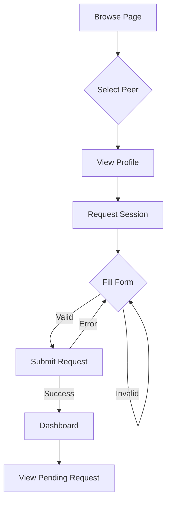
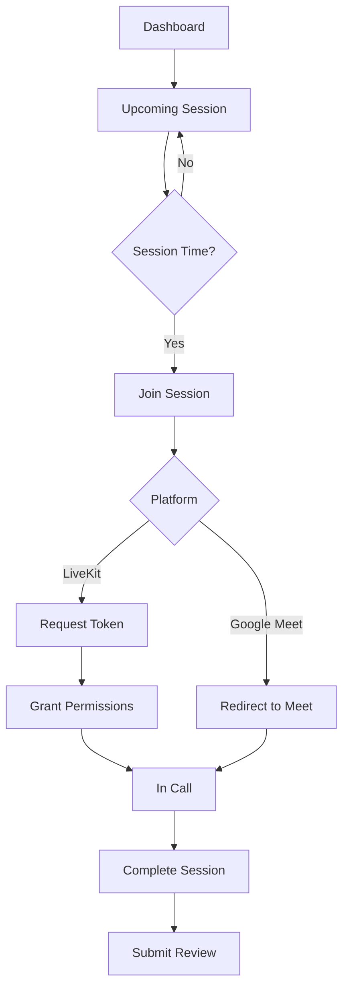

# UI Flows

## Flow 1: Booking a Session

### Start Page
**Page**: `/browse` (Peers tab)

### Steps

1. **Browse Peers**
   - User navigates to `/browse`
   - Sees list of peers with skills and ratings
   - Can filter by skills using skill selector
   - Can search by name/keywords

2. **View Peer Profile**
   - User clicks on a peer card
   - Navigates to `/profile/[userId]`
   - Views peer's skills (HAS), bio, ratings, reviews
   - Sees peer's availability (future feature)

3. **Request Session**
   - User clicks "Request Session" button
   - Navigates to `/request-session/[userId]`
   - Sees peer information at top
   - Fills out session request form:
     - Title (required, min 3 chars)
     - Description (optional)
     - Date and time picker (must be future date)
     - Duration selector (15-480 minutes)
     - Skills selection (at least one required)
   - Sees coin cost preview
   - Validates form in real-time

4. **Submit Request**
   - User clicks "Request Session" button
   - Form validates (shows errors if invalid)
   - Loading state shown during submission
   - API call made to create session request
   - Success toast notification shown
   - Redirects to `/dashboard`

5. **View Pending Request**
   - User sees session in "Pending Requests" on dashboard
   - Can view session details
   - Can cancel request (if not yet accepted)

### Edge Cases

**Insufficient Coins**:
- Error message: "Insufficient coins. You need X coins for this session."
- User can either earn coins or cancel request

**Invalid Date**:
- Validation error: "Session date must be in the future."
- Date picker prevents selecting past dates

**Form Validation Errors**:
- Inline error messages shown below each field
- Submit button disabled until form is valid

**Network Error**:
- Error toast: "Failed to request session. Please try again."
- Retry button available

---

## Flow 2: Joining a Live Call

### Start Page
**Page**: `/dashboard` or `/sessions/[sessionId]`

### Steps

1. **View Upcoming Session**
   - User sees session in "Upcoming Sessions" on dashboard
   - Or navigates directly to `/sessions/[sessionId]`
   - Sees session details:
     - Title, description
     - Date and time
     - Duration
     - Other participant
     - Skills covered

2. **Receive Reminder**
   - User receives push notification 5 minutes before session
   - Notification shows "Session starting soon"
   - Clicking notification navigates to session page

3. **Join Session**
   - On session date/time, "Join Session" button becomes active
   - User clicks "Join Session"
   - If LiveKit:
     - Frontend requests LiveKit token from backend
     - LiveKit client initialized
     - Browser requests camera/microphone permissions
     - User grants permissions
     - User joins LiveKit room
   - If Google Meet:
     - User redirected to Google Meet URL
     - User joins Google Meet call

4. **During Session**
   - Video/audio controls available:
     - Toggle camera on/off
     - Toggle microphone on/off
     - Share screen (if supported)
   - Chat widget available for text messages
   - Participant list shows who's in the call
   - Session timer shows elapsed time

5. **Complete Session**
   - After session, user clicks "Mark as Complete"
   - Confirmation dialog shown
   - User confirms
   - Session status updated to DONE
   - Payment released to teacher
   - Success notification shown
   - Review reminder notification sent

### Edge Cases

**Permission Denied**:
- Browser blocks camera/microphone access
- User can still join with audio/video disabled
- Message shown: "Camera/microphone access denied. You can enable it in browser settings."

**Token Generation Fails**:
- Error message: "Unable to join session. Please try again."
- Retry button available
- Alternative: Use Google Meet link if available

**Other Participant Not Joined**:
- Message shown: "Waiting for [Participant Name] to join..."
- User waits in room
- When other participant joins, session begins

**Network Disconnection**:
- Connection status indicator shown
- Automatic reconnection attempted
- User notified of reconnection status

**Session Timeout**:
- System automatically marks session as DONE after duration
- Users notified session has ended
- Payment released automatically

---

## Flow 3: Profile Setup

### Start Page
**Page**: `/onboarding` (after sign-up)

### Steps

1. **Start Onboarding**
   - New user signs up
   - Redirected to `/onboarding`
   - Sees multi-step onboarding flow

2. **Step 1: Basic Information**
   - Form fields:
     - Name (required)
     - Bio (optional)
     - Avatar upload (optional)
     - Location (optional)
     - School (optional)
     - Hourly rate (optional)
   - Real-time validation
   - "Next" button to proceed

3. **Step 2: Skills I Have**
   - Skill search/selector component
   - User searches for skills they can teach
   - Adds skills to "HAS" list
   - Can remove skills
   - "Back" and "Next" buttons

4. **Step 3: Skills I Want**
   - Same skill selector component
   - User searches for skills they want to learn
   - Adds skills to "WANTS" list
   - Can remove skills
   - "Back" and "Complete" buttons

5. **Complete Onboarding**
   - User clicks "Complete"
   - Form validates (at least one skill in HAS or WANTS)
   - Loading state shown
   - API call made to save onboarding data
   - User marked as onboarded
   - Success notification shown
   - Redirects to `/dashboard`

### Edge Cases

**Missing Required Fields**:
- Validation errors shown
- Cannot proceed to next step
- Error messages guide user

**No Skills Added**:
- Warning: "Please add at least one skill you have or want to learn."
- Cannot complete onboarding

**Avatar Upload Fails**:
- Error message: "Failed to upload avatar. Please try again."
- User can skip avatar or retry

**Network Error**:
- Error toast: "Failed to save profile. Please try again."
- User can retry submission

---

## Flow 4: Creating a Study Room

### Start Page
**Page**: `/dashboard` or `/create-study-room`

### Steps

1. **Navigate to Create Room**
   - User clicks "Create Study Room" button
   - Navigates to `/create-study-room`

2. **Fill Out Form**
   - Form fields:
     - Title (required, min 3 chars)
     - Description (optional)
     - Date and time picker (must be future)
     - Duration selector (15-480 minutes)
     - Maximum participants (2-50)
     - Joining fee in coins (minimum 0)
     - Skills selection (at least one required)
   - Real-time validation
   - Preview of room details

3. **Submit Room**
   - User clicks "Create Room"
   - Form validates
   - Loading state shown
   - API call made to create room
   - Success notification shown
   - Redirects to `/studyroom/[roomId]`

4. **Room Created**
   - User sees room details page
   - Room appears in browse results
   - Other users can discover and join
   - User receives notifications when others join

### Edge Cases

**Invalid Capacity**:
- Validation error: "Maximum participants must be between 2 and 50."

**Room Full**:
- When room reaches capacity, "Join" button disabled
- Message: "This study room is full."

**Date in Past**:
- Validation error: "Room date must be in the future."
- Date picker prevents past dates

---

## Flow 5: Writing a Review

### Start Page
**Page**: `/dashboard` or `/submit-review/[sessionId]`

### Steps

1. **Receive Review Reminder**
   - User receives notification after session completion
   - Notification: "Please review your session with [Name]"
   - Clicking notification navigates to review page

2. **Navigate to Review Page**
   - User clicks "Submit Review" on dashboard
   - Or navigates to `/submit-review/[sessionId]`
   - Sees session details at top

3. **Fill Out Review**
   - Star rating selector (1-5 stars)
   - Review text input (required, min 10 chars, max 1000 chars)
   - Real-time validation
   - Character count shown

4. **Submit Review**
   - User clicks "Submit Review"
   - Form validates
   - Loading state shown
   - API call made to create review
   - Success notification shown
   - Redirects to `/dashboard`

5. **Review Posted**
   - Review appears on reviewee's profile
   - Reviewee's average rating updated
   - Reviewee receives notification about new review

### Edge Cases

**Already Reviewed**:
- Error message: "You have already reviewed this session."
- User cannot submit another review

**Session Not Completed**:
- Error message: "You can only review completed sessions."
- Review form not available for incomplete sessions

**Invalid Rating**:
- Validation error: "Please select a rating."
- Cannot submit without rating

---

## Visual Flow Representation

### Booking a Session Flow

### Joining Live Call Flow

---

## Common UI Patterns

### Loading States
- Skeleton loaders for data fetching
- Spinner for form submissions
- Disabled buttons during async operations

### Error Handling
- Toast notifications for errors
- Inline validation errors in forms
- Retry buttons for failed operations
- Error boundaries for component errors

### Success Feedback
- Toast notifications for success
- Confirmation dialogs for important actions
- Success states in forms
- Visual feedback for completed actions

### Empty States
- Friendly messages when no data
- Call-to-action buttons
- Helpful guidance
- Illustrations/icons

