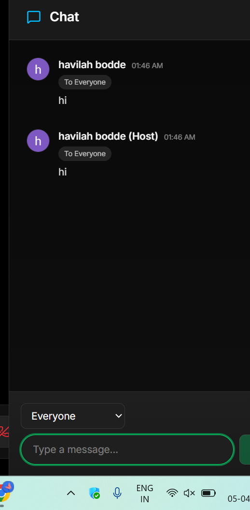
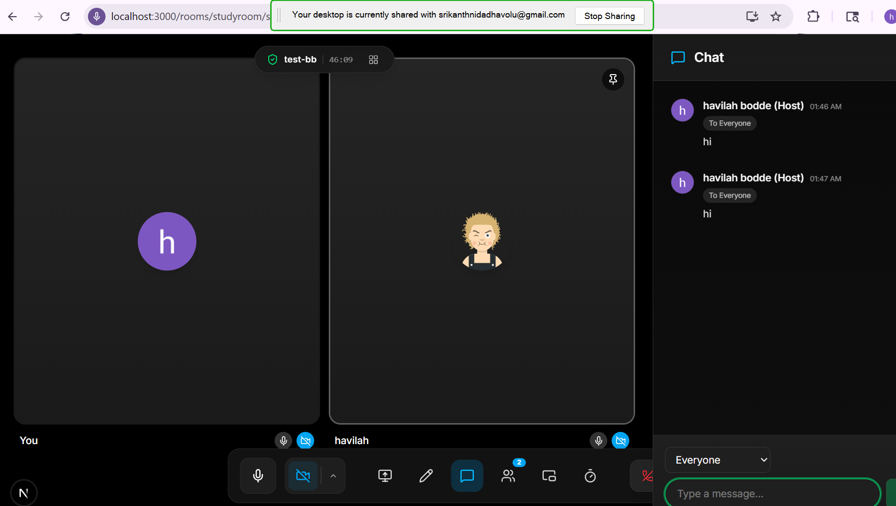

# Process logs (local dev)

Run from repo root: **`pnpm dev:log`**

Each process writes **two** files (both truncated at the start of each run):

| Process | Raw (exact tool output) | Detailed (timestamped lines) |
|--------|-------------------------|------------------------------|
| Nest API (`backend`) | `backend.log.txt` | **`backend.detail.txt`** |
| Next.js (`my-app`) | `my-app.log.txt` | **`my-app.detail.txt`** |

### Raw vs detailed

- **`.log.txt`** — stdout and stderr merged in arrival order, unchanged. Good for copying stack traces.
- **`.detail.txt`** — **one line per line of output**, each prefixed with:
  - ISO-8601 time
  - `[stdout]` or `[stderr]` so you can see which stream it came from
  - then the message

Use the **detail** file when you need to see **when** something happened and whether it was normal log vs error stream.

### Other commands

- `pnpm dev:log:backend` — backend only (both raw + detail for backend)
- `pnpm dev:log:frontend` — my-app only (both raw + detail for my-app)
